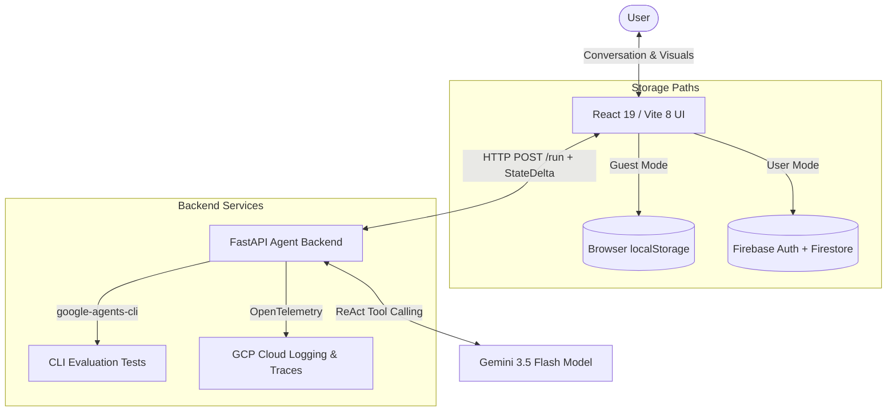

# Stride — Interactive Personal Finance Forecaster

> A secure personal financial concierge that replaces manual planning spreadsheets with a conversational copilot to model and simulate major life milestones in real time.

---

## 📌 1. The Problem

Financially anxious young adults have no intuitive way to know whether their daily financial decisions are moving them toward or away from major goals. This leaves them planning in isolation with no feedback loop and no clear progress to point to.

Major financial goals play out over months and years, but existing tools fail to support this horizon:
* **Budget Trackers (Rearview Mirror):** Apps like Mint, YNAB, or Copilot specialize in tracking and categorizing past spending. They fail to project when a user can afford a future goal based on their current balance trajectory.
* **Retirement Planners (Too Abstract):** Traditional wealth management software projects 30 years into the future. They are too abstract for near-term decisions like buying a car next year.
* **Spreadsheets (Tedious & Manual):** While Excel or Google Sheets can model future projections, they require manual rebuilding every session and a high degree of financial literacy to write complex formulas (such as debt interest amortizations).

---

## 🎯 2. The Solution

Stride bridges this gap by acting as a **Homeownership & Milestone Readiness Concierge**. 

* **Conversational Planning:** The user chats with **Stride AI**, an expert conversational planner powered by **Gemini 3.5 Flash** and the **Google Agent Development Kit (ADK)**. Instead of filling out confusing forms, a user can write natural statements: *"I want to buy a house in 2 years. We need a $70,000 down payment."*
* **Dynamic Projections:** The agent parses this request, calls the correct milestone constructor tool, runs a 60-month daily running cashflow simulation, and explains the results.
* **Proactive Trade-offs:** If a plan is "At Risk" (e.g. going negative in Month 18), the agent calculates and recommends trade-offs (e.g., delaying the purchase, increasing extra debt payments, switching payoff strategy to Avalanche, or cutting monthly spending).
* **Interactive Form Widgets:** For complex goals (like a sabbatical with partial income pauses), the agent appends a form tag (e.g., `[FORM: sabbatical]`). The frontend UI intercepts this tag and renders a parameter form directly inside the chat window.

---

## 🏗️ 3. System Architecture

Stride is built using a decoupled architecture, linking a modern React web application to a Python agent backend.

### Architecture Flow



### Core Technologies
* **Frontend:** React 19, Vite 8, TypeScript, Recharts (for the daily balance graph), and Vanilla CSS.
* **Backend:** Python, FastAPI, Uvicorn, Google Agent Development Kit (ADK).
* **AI Model:** Gemini 3.5 Flash (optimized for low latency and high tool-calling precision).
* **Storage:** Hybrid model utilizing versioned `localStorage` (`stride_state_v1`) for guests, and **Firebase Authentication** + **Firestore Database** for registered users.

---

## ⚙️ 4. Setup & Installation

Follow these steps to run both the React frontend and the Python agent backend locally.

### Prerequisites
* **Node.js** v18.x or v20.x (LTS)
* **Python** v3.11.x
* **uv** (Python package manager) - [Install Guide](https://docs.astral.sh/uv/getting-started/installation/)

---

### Step A: Start the Python Backend (`stride-agent`)

1. **Navigate to the agent directory:**
   ```bash
   cd stride-agent
   ```
2. **Install dependencies:**
   Install `agents-cli` globally or via uv:
   ```bash
   uv tool install google-agents-cli
   agents-cli install
   ```
3. **Configure Environment Variables:**
   Create a `.env` file in the `stride-agent/` directory:
   ```env
   GEMINI_API_KEY=your_gemini_api_key_here
   ALLOW_ORIGINS=http://localhost:5173
   ```
4. **Run the FastAPI App:**
   ```bash
   uv run python -m app.fast_api_app
   ```
   The backend server will spin up and run on **[http://localhost:8000](http://localhost:8000)**.

---

### Step B: Start the React Frontend

1. **Navigate to the root directory:**
   ```bash
   cd ..
   ```
2. **Install node dependencies:**
   ```bash
   npm install
   ```
3. **Run the development server:**
   ```bash
   npm run dev
   ```
4. **Access the application:**
   Open your browser and navigate to: 👉 **[http://localhost:5173](http://localhost:5173)**

---

## 🧪 5. Testing & Code Quality

Both projects contain extensive automated test suites to prevent regressions.

### Frontend Test Suite (Vitest)
Verify mathematical projections, datepickers, and UI components:
```bash
npm run test
```

### Backend Agent Tests (Pytest & Evals)
Verify agent routing and connection endpoints:
```bash
cd stride-agent
uv run pytest tests/
```

To run the agent's evaluation and grading suite using `google-agents-cli`:
```bash
agents-cli eval run
```
This executes the evaluation cases located in `tests/eval/datasets/` and grades them against the custom LLM quality metrics configured in `tests/eval/eval_config.yaml`.
